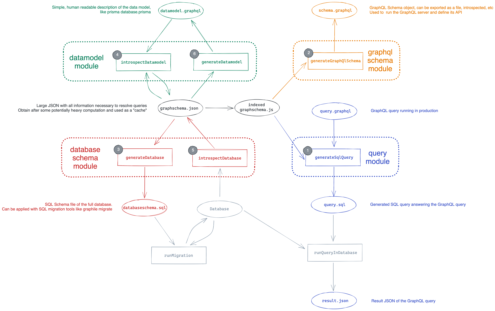

<div id="top"></div>

<br />
<div align="center">
   <a href="https://github.com/rtg-project/rtg/">
    
  </a>

  <h3 align="center">RTG</h3>

  <p align="center">
    Relational (SQL) to Graph (GraphQL) tranformation tool. Fast.
    <br />
    <a href="https://github.com/rtg-project/rtg"><strong>Explore the docs »</strong></a>
    <br />
    <br />
    <a href="https://github.com/rtg-project/rtg">View Demo</a>
    ·
    <a href="https://github.com/rtg-project/rtg/issues">Report Bug</a>
    ·
    <a href="https://github.com/rtg-project/rtg">Request Feature</a>
  </p>
</div>
<br />
<br />


## About

rtg is a versatile relational (SQL) to graph (GraphQL) transformation tool in rust, for rust, javascript, typescript, and maybe python.



### Built With

* [Rust](https://www.rust-lang.org/)
* [NodeJS](https://nodejs.org/en/)

<p align="right">(<a href="#top">back to top</a>)</p>

## Getting Started

To get started using rtg,

### Prerequisites

This is an example of how to list things you need to use the software and how to install them.

* npm
  ```sh
  npm install npm@latest -g
  ```

### Installation

1. Clone the repo
   ```sh
   git clone https://github.com/rtg-project/rtg.git
   ```
2. Install NPM packages
   ```sh
   npm install
   ```
   
<p align="right">(<a href="#top">back to top</a>)</p>

## Usage

- Create a Model
- Process a graphql document using this model

<p align="right">(<a href="#top">back to top</a>)</p>

## Roadmap

See the project road map on Github https://github.com/rtg-project/rtg/projects/1

- [x] Basic GraphQL to SQL transformer
- [ ] Generate model from GraphQL Schema Definition Language files
- [ ] Add support for relation filters
- [ ] Add support for aggregations

<p align="right">(<a href="#top">back to top</a>)</p>

## Contributing

Not taking external contributions at this point

<p align="right">(<a href="#top">back to top</a>)</p>

## License

rtg is primarily distributed under the terms of both the MIT license and the Apache License (Version 2.0).

See LICENSE for details.

<p align="right">(<a href="#top">back to top</a>)</p>

## Contact

Vincent Lecrubier - [@VLecrubier](https://twitter.com/VLecrubier)

Project Link: [https://github.com/rtg-project/rtg/](https://github.com/rtg-project/rtg/)

<p align="right">(<a href="#top">back to top</a>)</p>

## Acknowledgments

Use this space to list resources you find helpful and would like to give credit to. I've included a few of my favorites to kick things off!

* [Vercel for hosting](https://vercel.com/)
* [NextJS for the website](https://nextjs.org/)
* [SWC for the inspiration of a brilliant rust/typescript tool](https://swc.rs/)
* [othneildrew for the Best-README-Template](https://github.com/othneildrew/Best-README-Template)

<p align="right">(<a href="#top">back to top</a>)</p>
